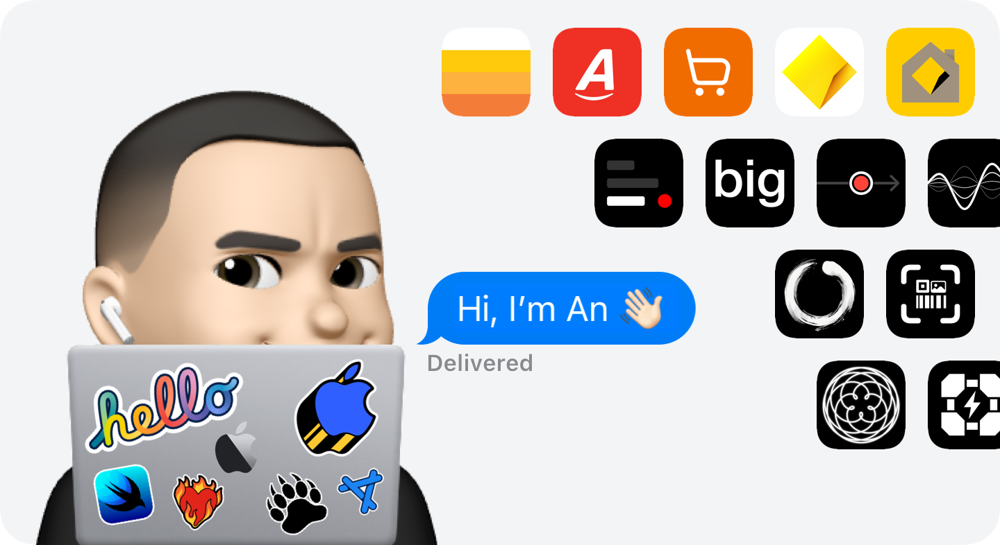
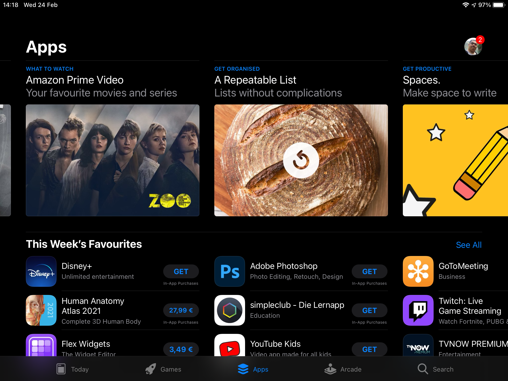
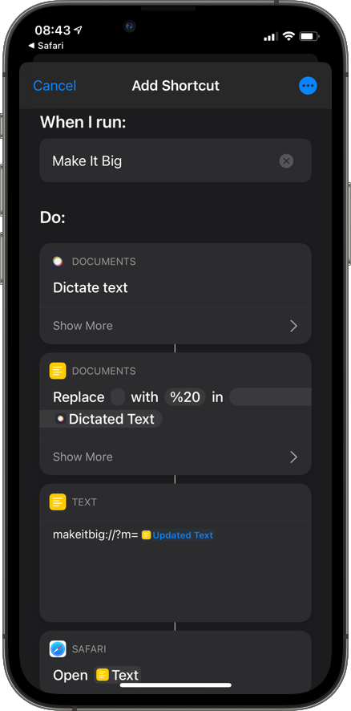

I’m a software engineer with over 10 years of commercial iOS development experience. 
My purpose is to create apps that people just love to use.

&nbsp;

&nbsp;

&nbsp;

# A Repeatable List

 

Create a list, complete it, repeat it.

> SwiftUI, App Clip, Lock Screen Widgets, Home Screen Widgets, Drag & drop support, Dark mode support, Voiceover & Dynamic Text support, Localised to 32 languages, Taptic feedback

🤩 Featured by  Apple in Japan, September 2022

🤩 Featured by  Apple in 8 Countries, February 2021

&nbsp;&nbsp;&nbsp;&nbsp;&nbsp;

&nbsp;&nbsp;&nbsp;&nbsp;&nbsp;

<a href="https://2020.airport.community"> Airport Design Award</a>

 

# Make It Big

 

Show large text on your screen.

> Over 822,000 downloads, Lock Screen Widgets, Home Screen Widgets, Action Extension, Dark mode support, Voiceover & Dynamic Text support, Localised to 37 languages, Taptic feedback, Custom App Icons, URL Scheme deeplinking, Using SF Symbols

🤩 Featured by  Apple in 41 Countries, May 2022

😍 Mentioned in the App Store Story: [Discover the Apps Behind CODA](https://apps.apple.com/gb/story/id1582547591), February 2022

🤩 Featured by  Apple in 23 Countries, February 2014 - June 2014

&nbsp;&nbsp;&nbsp;&nbsp;&nbsp;

> Siri Shortcut: Allows you to dictate text, then enlarges it in the Make It Big app

 

# Point in time

 

Track a single point in time.

> SwiftUI, ActivityKit (Dynamic island, Live activities), BackgroundTasks, CoreMotion, WidgetKit (Lock screen and Home screen widgets)

&nbsp;&nbsp;&nbsp;&nbsp;&nbsp;

 

# Speech to Image

 

A conversation visualiser. Converts your speech to images, providing context to conversations.

> Swift Playgrounds 4 app, SwiftUI, Speech API (Speech Recognition), Natural Language API (to identify adjectives/nouns), Async/Await

&nbsp;&nbsp;&nbsp;&nbsp;&nbsp;

 

# Pong AR

 

Play Pong with your face!

> SwiftUI, ARKit, SpriteKit, GameKit (Game Center leaderboard), Taptic feedback

&nbsp;&nbsp;&nbsp;&nbsp;&nbsp;

 

# Code Scanner

 

Scans for codes using your camera, or from an image in your photos.

> SwiftUI, Vision Framework, AVFoundation, Taptic feedback, Action Extension (scan codes from Image share sheet)

&nbsp;&nbsp;&nbsp;&nbsp;&nbsp;

 

# Zen AF

 

Minimalist Pomodoro Timer.

> SwiftUI, Taptic feedback, AirPlay (AVKit)

&nbsp;&nbsp;&nbsp;&nbsp;&nbsp;

 

# UK COVID-19 Statistics

 

Track the latest coronavirus (COVID-19) daily new cases and deaths in the UK.

> Open source, Swift Charts, SwiftUI, Async/Await, Widget, Background task to fetch periodically, local notifications

&nbsp;&nbsp;&nbsp;&nbsp;&nbsp;

 

# Battery Level - Portal

 

Monitor the current battery level of your device. As you charge your device, the battery level will be announced.

> Dark mode support, Custom App Icons, Taptic feedback, Siri Shortcuts

&nbsp;&nbsp;&nbsp;&nbsp;&nbsp;

 

# Spiro

  

An interactive animating spirograph generator.

> Swift Playgrounds 4 app, Open source, SwiftUI

&nbsp;&nbsp;&nbsp;&nbsp;&nbsp;

 

# SF Symbols Browser

SwiftUI app to search and showcase SF Symbols. 🔎

> Open source, SwiftUI, (enum style values, searchable modifier, dismiss environment variable, text selection, multiple sheet presentation, foundation pluraliser)

&nbsp;&nbsp;&nbsp;&nbsp;&nbsp;

 

# buttoncraft

SwiftUI app to allow other developers craft that perfect SwiftUI button effect. 👌🏼

> Open source, SwiftUI

&nbsp;&nbsp;&nbsp;&nbsp;&nbsp;

 

# 🌱 Open source projects & experiments

# 🪴 Personal apps

&nbsp;

&nbsp;

&nbsp;

&nbsp;

&nbsp;

&nbsp;

&nbsp;

&nbsp;

&nbsp;

# 🌳 Work (current)

# 🌲 Work (past)

&nbsp;

&nbsp;

&nbsp;

